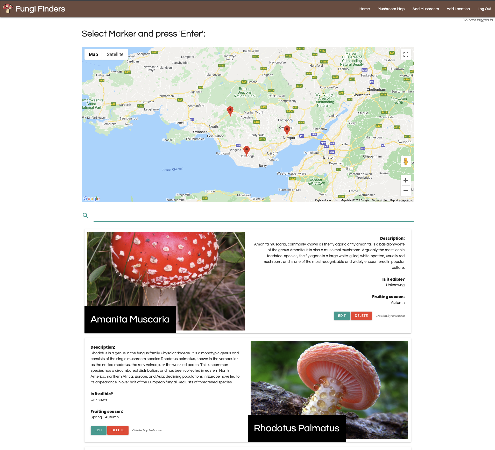

# Fungi Finders - Mushroom Location Map & Database

Fungi Finders was created to allow people who are interested in foraging or learning about mushrooms to have a resource that allows them to plan outdoor visits to locations where mushrooms have been reported by other users. The idea is that a community of fungi lovers could build and share a single database of where to find particular mushrooms and basic information on how to identify mushrooms that may be stumbled up in nature, based on location.
 
This project was built using Flask and Python for the backend control and MongoDB for storing and querying the data.
 
 
### <b>IMPORTANT NOTE: The locations and mushroom information added to this website at this time IS NOT accurate and has simply been used to fill out the website content and demonstate its features.</b>
 

## Wireframe:
- Wireframe was created using Balsamiq.
- [View full wireframe here](static/images/fungi-finders-wireframe.png)

## Features 

This site offers non-registered users a map of location markers that have been reported by other users that shows what mushrooms can be found at those locations once they click on a Google Maps marker. Once the user registers and logs in, they are able to edit and delete mushroom entries and add location markers to the map, however there are some important features to making this site fully functional that are still left to implement.

### Features Left to Implement:

- Currently, the user can add a location marker and add a mushroom to the database, however they are unable to add reported locations to the mushroom entries successfully; the location names are being stored inside each mushroom entry as a list array, but I had difficulty formatting a way to populate and add new items to the array in MongoDB from the front end.
- The Google Maps API uses Javascript for control and when a marker is clicked, I could not figure out how to send the Javascript frontend event back to the Flask backend to fetch and dynamically build the required data from MongoDB. As a work around for now, I used the Javascript Library 'listJS' to add search functionality for an unordered list, so the mushroom lists are not being dynamically 're-created' from MongoDB, but rather ALL the mushroom entries are being dynamically loaded by default and then listJS is being used to hide non-relevant entries. This functionality with MongoDB will eventually replace the need for listJS.
- Other features such as being able to sort the lists alphabetically, autofill location names based on currently stored locations, and eventually have an option to REVERSE the functionality so that selecting a specific mushroom can plot ALL the markers associated with only that mushroom on the Google Map, so you could specifically find a mushroom you are looking for and all the locations where it grows.

## Testing 

Chrome was used to create this website and it is only FULLY currently functioning as should on Chrome. Safari and Firefox have been tested there is an error with the Google Maps API; once the error has been closed the map still functions as it should but displays that it is 'for development purposes only'.

### Validator Testing 

- HTML - [W3C Validator](https://validator.w3.org/nu/?doc=http%3A%2F%2Fflask-mushroom-forager-project.herokuapp.com%2F)
  - The site currently has no errors from the W3C Validator.
- CSS - [Jigsaw Validator](https://jigsaw.w3.org/css-validator/validator?uri=http%3A%2F%2Fflask-mushroom-forager-project.herokuapp.com%2F&profile=css3svg&usermedium=all&warning=1&vextwarning=&lang=en)
  - No errors were found with custom CSS however there is an error inside the Materialize Library CSS.
- Javascript - [Jshint](https://jshint.com/) 
  - No serious issues were detected when passed through the Jshint validator.
- Python PEP8 Compliant - [PEP8 Online](http://pep8online.com/) 
  - No errors detected and is PEP8 compliant.

### Unfixed Bugs

- As previously mentioned, adding locations to the mushroom entries does not work as intended as they need to be added into an array; currently you can add a location and it will be stored as a string instead of an array, but this is not suitable for the intended advanced use.
- When navigating to the 'edit_mushroom.html' page, it populates the 'found at" locations as a list array converted to a string with array brackets, and then destroys the MongoDB entry array format for 'found at when submitted and turns the field back from array to string.
- An unknown issue with the Google Maps API is causing an error in Safari and Firefox.

## Deployment

This site has been deployed using Heroku, the live link can be found here - http://flask-mushroom-forager-project.herokuapp.com/

## Credits 

- The programming languages used were HTML5, CSS3, Python and Javascript.
- The core Flask and PyMongo setup configuration coding was given in the Code Institute learning materials and modified to suit.

### Frameworks, Libraries and Programs:

1. [Materialize CSS:](https://materializecss.com/)
    - Materialize CSS was used for its grid system and minimal but tidy styling.
1. [Google Fonts:](https://fonts.google.com/)
    - Google fonts were used to import the 'Questrial' font for most of the body text on the site and the 'Poppins' font was used for bold text items.
1. [Font Awesome:](https://fontawesome.com/)
    - Home page icons loaded from Font Awesome.
1. [GitPod](https://www.gitpod.io/)
    - GitPod was the IDE used to create the code.
1. [GitHub:](https://github.com/)
    - GitHub is used to store the projects code after being pushed from GitPod.
1. [List.js:](https://listjs.com/)
    - List.js was used to hide and reveal mushroom entries based on marker clicks.

### Media:

- Hero image on home page was downloaded from [Pexels](https://www.pexels.com/photo/forest-fungus-landscape-moss-361186/)
